slidenumbers: true
footer: ViewComponents in the real world - joel@hawksley.org
code: Menlo Regular, #d2a8ff, #79c0ff, #0366d6, #ff7b72, #d73a49
autoscale: true

## ViewComponents in the real world


^ Hi

^ My name is joel

^ Thanks for coming to this session

^ Today I'm going to share some lessons we've learned building ViewComponents at GitHub over the past year.

---

[.hide-footer]


^ I'm an engineer at on Design Systems team at GitHub

---

[.hide-footer]
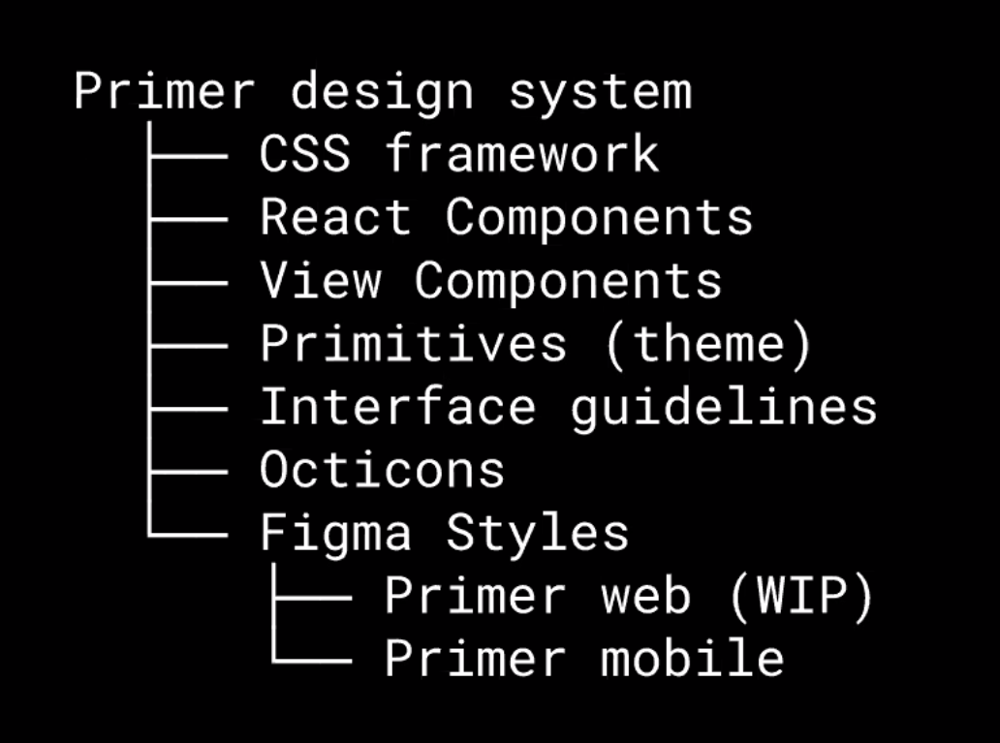

^ responsible for the Primer design system used throughout GitHub

^ as you can see it's really a system of systems

---

[.hide-footer]


^ My job on the team

^ Make building consistent, accessible, resilient UI in our Rails monolith an enjoyable experience

^ All at a pretty incredible scale

^ To give you an idea of our scale, here are a few stats

^ It seems like people always ask me about these when I'm talking about our application

---

# est. 2007

^ The GitHub rails app is over thirteen years old, and it..

---

# 10k's requests/second

^ receives tens of thousands of requests per second

---

# ~ two dozen services

^ We have extracted around two dozen services

^ into what some people call a citadel architecture

^ A lot of our services are written in Go

^ including functional areas such as webhook delivery

^ PAUSE

^ but most of GitHub is a Rails monolith.

^ A big monolith that's growing quickly.

---

# 580 models

## +144 YoY (33%)

^ `grep -lr "< ApplicationRecord" app/models | wc -l`

^ We have almost 600 models

---

# 4671 views

## +702 YoY (18%)

^ `find app/views -type f -name "*.html.erb" | wc -l`

^ Almost 4700 views

---

# 807 controllers

## +206 YoY (36.8%)

^ `find app/controllers -type f -name "*_controller.rb" | wc -l`

^ and over 800 controllers

^ PAUSE

---

# 2015 GET routes

^ We have over two thousand pages in the application.

^ All of them need to stay current,

^ even if they're obscure settings pages out of the critical path.

---

^ This scale makes for some interesting problems.

^ Things that might be a small annoyance in smaller applications can

^ become serious roadblocks at our scale.

^ PAUSE

---

[.slidenumbers: false]
[.footer:]


^ When you have a body of work like this

^ patterns start to emerge

^ PAUSE

---

^ One issue we've had is figuring out

^ which template rendered a specific line of HTML

---

[.slidenumbers: false]
[.footer:]
[.background-color: #FFFFFF]


^ for example, when looking at a PR page,

^ if I want to edit the badge that display the draft status here

^ how do a I find the right place to make my change?

---

[.slidenumbers: false]
[.footer:]
[.background-color: #FFFFFF]
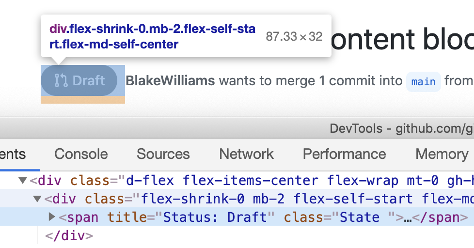

^ I could try searching by the specific class names on the element,

^ this approach is often not very reliable if you're using function CSS class names like we are

^ In this case, if we search for the class names on the element, we get dozens of results.

---

^ PAUSE

^ In thinking about this problem, we came up with the idea to add HTML comments

^ at the beginning and end of each template's output, with the path of the template file.

---

[.code-highlight: 0]
[.code-highlight: 1]
[.code-highlight: 2]
[.code-highlight: 3]
[.code-highlight: 5-7]
[.code-highlight: 11]

```ruby
class CustomHandler < ActionView::Template::Handlers::ERB
  def call(template)
    out = super

    "<!-- BEGIN: #{ template.path } -->\n" +
    out +
    "<!-- END: #{ template.path } -->\n'"
  end
end

ActionView::Template.register_template_handler(:erb, CustomHandler.new)
```

^ We did this by writing a custom ERB compiler

^ S we start by defining a custom compiler as a subclass of the existing ERB compiler

^ S with a call method that receives a template object

^ S get the original output of the ERB compiler

^ S and wrap it in HTML comments with the template's path.

^ S Finally, we register our custom compiler with Rails.

^ PAUSE

^ Now going back to our page,

---

[.slidenumbers: false]
[.footer:]
[.background-color: #FFFFFF]


^ We now see which template rendered a part of a page.

^ In this case, it's a

^ PAUSE

^ After seeing the benefits of this patch internally,

---

[.slidenumbers: false]
[.footer:]
[.background-color: #FFFFFF]


^ We extracted it into Rails!

^ It's part of Rails 6.1.

---

### `config.action_view.annotate_template_file_names`

^ You can turn it on with the configuration variable

^ And new Rails applications have it enabled by default in local development

---

[.slidenumbers: false]
[.footer:]


^ PAUSE

^ Another issue that's come up is getting the application into the right state

^ in local development so we can test visual changes

^ part of this is due to GitHub's architecture

---

# Architecture

^ As I mentioned

^ We have a main Rails monolith and about two dozen services.

^ this can make it difficult to get local development into the right state

---
# TDD

^ Unfortunately, we don't have browser-based tests

^ This is mainly due to how much time they would add to our test suite.

^ PAUSE

^ However, we do write plenty of controller tests.

^ After numerous pairing sessions helping our designers

^ get their local development environments into the right state,

^ I had an idea- what if we could temporarily convert controller tests...

---

# Controller -> System

^ Into system tests?

^ That way, we could reuse all of the existing setup code from our controller tests

^ To preview the application in a specific state to make visual changes?

---

[.code-highlight: all]
[.code-highlight: 2]
[.code-highlight: 4]

```ruby
test "loads successfully" do
  get "/#{@user}"

  assert_response :ok
end
```

^ As a quick refresher, this is what a controller test looks like

^ S It calls `get` with a URL

^ S and then makes an assertion, in this case asserting against the response code

^ So how can we convert this into a system test?

---

[.code-highlight: 1]
[.code-highlight: 2-4]
[.code-highlight: 6-9]
[.code-highlight: 14]

```ruby
module SystemTestConversion
  def self.included
    ActionDispatch::SystemTestCase.driven_by(:selenium, using: :chrome)
  end

  def get(path)
    visit(path)
    binding.irb # intentionally pause
  end

  def assert_response; end
end
```

^ We start by writing a module, called system test conversion

^ S That when it's included, registers some configuration for ActionDispatch::SystemTestCase

^ Then in this case we just need to...

^ S redefine `get` to visit the path provided, and then pause with a debugger

^ S and for `assert_response` to be a no-op

^ PAUSE

^ From there

---

```ruby
# test/test_helper.rb

if ENV["RUN_IN_BROWSER"]
  IntegrationTestCase.send(:include, SystemTestConversion)
end
```

^ We conditionally include the  module if `RUN_IN_BROWSER` is appended to a command to run a test.

---

[.slidenumbers: false]
[.footer:]
[.background-color: #FFFFFF]


^ And here's what it looks like in action...

---

^ Unlike template annotations, this hasn't made it into Rails.

^ I'm not sure it's a good idea or not, but it's served us well.

^ But there is a more generally lesson here.

---

# Seeds vs. test setup

^ Our seeds and test setup code has a lot of overlap!

^ I'm curious to see if there's ways we could bridge the gap between these conceptual domains.

---

[.slidenumbers: false]
[.footer:]


^ PAUSE

^ While working on these projects

^ we identified another source of friction

---
# View -> route(s)

^ When modifying a template,

^ It can be difficult to know where it's used.

^ Not knowing where a template is used is risky, as we have a lot of template reuse.

^ Colleague John Hawthorn made a diagram of how our templates reference each other...

---

[.slidenumbers: false]
[.footer:]
[.background-color: #FFFFFF]


^ As you can see

^ Navigating our render stack might be a little tricky

^ PAUSE

^ So built a tool called Viewfinder

^ Here's how it works:

---

### `viewfinder wiki/show.html.erb`

^ We pass in the path to the template, in this case the wiki show page.

---

```ruby
grep(
  /wiki/show/,
  paths: [Rails.root.join("app/**/*")]
)
```

^ Then we extract the template string literal, in this case `wiki/show`

^ And search for it in the codebase.

^ Just like you might search in your text editor.

---

```ruby
root_node = Parser::CurrentRuby.new.parse(file_contents)
```

^ Then, for each search result, we load the file with the Parser gem,

^ Which returns an Abstract Syntax Tree of the file.

^ For example, one of the matches for our search was a controller. Here's part of the syntax tree:

---

[.code-highlight: all]
[.code-highlight: 10-11]

```
s(:block,
  s(:send, nil, :respond_to),
  s(:args,
    s(:arg, :format)),
  s(:begin,
    s(:block,
      s(:send,
        s(:lvar, :format), :html),
      s(:args),
        s(:send, nil, :render,
          s(:str, "wiki/show")),
```

^ This data structure represents how Ruby interprets the code we write.

^ As an aside, the Rubocop linter works by analyzing these data structures.

^ S And you can see at the bottom that we have our render call to `wiki/show`

^ For reference, here is the equivalent Ruby code for this tree:

---

```ruby
respond_to do |format|
  format.html do
    render "wiki/show"
  end
end
```

```
s(:block,
  s(:send, nil, :respond_to),
  s(:args,
    s(:arg, :format)),
  s(:begin,
    s(:block,
      s(:send,
        s(:lvar, :format), :html),
      s(:args),
        s(:send, nil, :render,
          s(:str, "wiki/show")),
```

^ PAUSE

^ EXPLAIN CODE

^ So once we have the syntax tree, we can query it!

---

[.code-highlight: 0]
[.code-highlight: 1]
[.code-highlight: 2]

```ruby
if node.type == :send
  case node.method_name
  when :render
    # inspect method arguments
  end
end
```

^ Not going to go into too much detail at this point

^ but we are able to find the calls to `render`

^ S by looking at the type of the syntax node

^ S and then the method name

^ And we do this to confirm that the render call is referring to the template we're tracing

---

^ We continue until we reach a controller action.

^ Then, going back to the syntax tree...

---

```
s(:def, :show,
  s(:args),
```

^ We look up the tree until we find the definition of the controller method.

---

# WikiController#show

^ Which in this case is the show method on the wiki controller.

---

```ruby
get "wiki/*path", to: "wiki#show"
```

^ From there, we look up the routes that render that controller action,

^ and return the result to the console:

---

```
2 uses of wiki/show found:

ROUTE: /:user_id/:repository/wiki/*path () =>
CONTROLLER: app/controllers/wiki_controller.rb#show =>
wiki/show.html.erb

ROUTE: /:user_id/:repository/wiki (wikis) =>
CONTROLLER: app/controllers/wiki_controller.rb#index =>
wiki/show.html.erb
```

^ PAUSE

^ By itself, this tool was really useful.

^ We could see all of the routes that rendered a template!

^ But then we realized:

---

# Route -> test

^ We could use these routes to identify which controller tests

^ rendered our template!

^ We did this through a similar process to what got us to this point

---

```ruby
grep(
  /get ".*"/,
  paths: [Rails.root.join("test/integration/**/*")]
)
```

^ We start by finding all of the `get` calls from our controller tests

---

`get "/joelhawksley/demo/wiki/"`

^ For example, here is a call that loads a wiki page.

^ So we extract the argument from this call, and pass it into...

---

[.code-highlight: 1]
[.code-highlight: 3-8]

```ruby
Rails.application.routes.recognize_path("/joelhawksley/demo/wiki/")

{
  controller: "wiki",
  action: "index",
  user_id: "joelhawksley",
  repository: "demo"
}
```

^ The Rails code path that takes a request path...

^ S and returns a route!

^ And we repeat this over and over, for every controller test

^ Building up a hash that looks something like this:

---

```ruby
"wiki#index" =>
  [
    "test/integration/wiki_controller_test.rb:278",
    ...
  ]
```

^ Where we have the controller action as the key

^ and the matching tests as an array of values.

^ PAUSE

^ With this lookup hash, we can then include which tests render the view:

---

[.code-highlight: 6-7]

```
ROUTE: /:user_id/:repository/wiki/*path () =>
CONTROLLER: app/controllers/wiki_controller.rb#show =>
wiki/show.html.erb

    These tests may render this template:
    test/integration/wiki_controller_test.rb:278
    test/integration/wiki_controller_test.rb:289
    ...
```

^ We can then use these test cases with our system test conversion tool

^ To visually verify the changes to our template in a browser.

^ PAUSE

---

# Downsides

^ only works with explicit render calls

^ where a template name is passed to `render`

^ something we enforce with a linter

^ doesn't account for conditionals

^ this is an optimistic approach

^ it returns all possible routes

^ PAUSE

^ it's proved incredibly useful for us

^ but definitely not ready for prime time

---

[.slidenumbers: false]
[.footer:]


^ PAUSE

^ But the biggest challenge has been a missing abstraction in our view layer.

---

# Rule of three

> The first time you do something, you just do it. The second time you do something similar, you wince at the duplication, but you do the duplicate thing anyway. The third time you do something similar, you refactor.

- Martin Fowler, _Refactoring, Ruby Edition_

^ A common rule of abstraction is the Rule of Three. I like Martin Fowler's definition: READ QUOTE

^ Usually when we do something over and over again, we abstract it!

^ If we don’t, our code becomes inconsistent and hard to maintain...

---
# Problem

^ And this is especially true in our view code.

^ We often build templates by copying existing ones.

^ It's incredibly difficult to make sweeping changes to our view code,

^ limiting the leverage our team has with our design system.

---

# Standards

^ More generally, our Rails code often doesn't live up to the standards

^ we hold our Ruby code to.

---

# Testing

^ And Views are generally tested with slow integration or system tests.

^ PAUSE

---

# 2019

^ 2019

^ Has a crazy idea

^ For using Ruby objects to render views

^ Inspired by ideas from React

^ We now call it ViewComponent:

^ A framework for building reusable, testable & encapsulated view components in Rails.

---

[.column]

```ruby
# test_component.rb

class TestComponent < ViewComponent::Base
  def initialize(title:)
    @title = title
  end
end
```

[.column]

```erb
<%# test_component.html.erb %>

<span title="<%= @title %>">
  <%= content %>
</span>
```

^ A ViewComponent is a Ruby file and a template.

^ EXPLAIN CODE

---


```erb
<%= render(TestComponent.new(title: "my title")) do %>
  Hello, World!
<% end %>
```

^ To render it, we instantiate the component and pass it to `render`

^ EXPLAIN CODE

---

```html
<span title="my title">
  Hello, World!
</span>
```

^ Which then returns the resulting HTML.

^ PAUSE

---

[.code-highlight: 0]
[.code-highlight: 2]
[.code-highlight: 4]
[.code-highlight: all]

```ruby
def test_render_component
  render_inline(TestComponent.new(title: "my title")) { "Hello, World!" }

  assert_selector("span[title='my title']", text: "Hello, World!")
end
```

^ To test the component, we can write a unit test...

^ S That renders the component

^ S and then asserts against the output using matchers from Capybara.

^ S These tests are incredibly fast. In our code base they are around 100x faster than controller tests.

^ PAUSE

^ Having this ability has been a game changer.

^ We used to treat DOM tests as a luxury, and now they're basically free.

---

# Adoption

^ PAUSE

^ And since then, we've rapidly adopted the pattern in GitHub.com

^ to go back from our stats from earlier,

^ The GitHub application grew about 25% last year.

^ Except for our ViewComponents, which...

---
# 397 ViewComponents

## +373 YoY (1554%)

^ `find app/components -type f -name "*.rb" | wc -l`

^ Grew by over 15 times!

^ and we've learned a lot in the process.

^ PAUSE

---

# Consistency

^ One of the goals of the design systems team is to help our developers build consistent UI.

^ ViewComponents have been a key part of accomplishing this goal.

---

[.slidenumbers: false]
[.footer:]
[.background-color: #FFFFFF]


^ For example, last summer my colleague Christian built a ViewComponent for the counters we use throughout the app

^ Here they are on the repository navigation

^ We render counters in over a hundred places in the app

^ PAUSE

^ Looking at one of his PRs

---

[.slidenumbers: false]
[.footer:]
[.background-color: #FFFFFF]


^ We can see that for one counter, we wrapped the amount in number with delimiter

^ And in the other case, ae didn't.

^ This led to visual inconsistencies,

^ but only in edge cases we'd never expect a developer think about when working on a feature.

---

[.slidenumbers: false]
[.footer:]
[.background-color: #FFFFFF]


^ Instead, we simply pass the raw count to the component, and it handles formatting the value in a consistent way.

^ PAUSE

---

# Performance

^ Another benefit we've seen from ViewComponents has been in helping developers write performant code.

^ One of the most common performance issues I've seen in view code is unintentionally querying the database.

---

```erb
<% if repository.writable_by?(current_user) %>
  ... <!-- edit button, etc -->
<% end %>
```

^ For example, we often have permission checks in our views to determine whether to show certain elements or not.

^ Unfortunately, these checks trigger queries if not batched properly.

^ So to help developers understand how their view code might interact with the database...

---

[.code-highlight: none]
[.code-highlight: 1]
[.code-highlight: 2-4]

```ruby
def render_inline(component, allowed_queries: 0)
  assert_query_counts(allowed_queries) do
    super(component)
  end
end
```

^ We redefined the helper used to render ViewComponent in unit tests

^ S To accept a number of allowed queries, defaulting to zero allowed

^ S We then render the component, failing the test if the actual number of queries doesn't match what was expected.

^ This helper has turned out to be quite educational.

---

^ PAUSE

^ It's helped us better understand the side affects of our code

^ prevented the introduction of several N+1 queries.

---


[.slidenumbers: false]
[.background-color: #FFFFFF]
[.footer:]

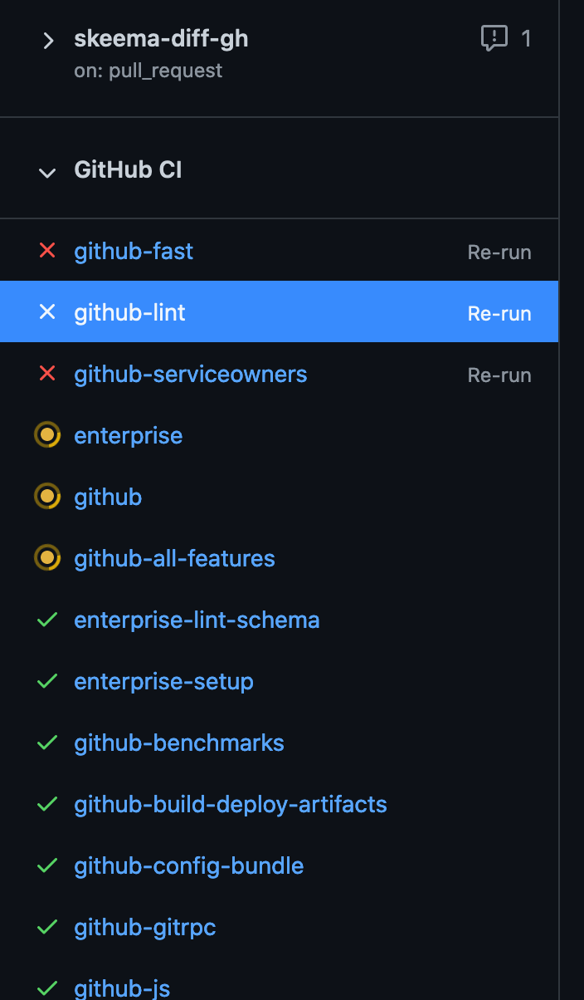

^ In one recent case on the checks page, this saved over 100ms of overhead per request.

---

# Complexity

^ Another advantage we've seen with ViewComponents is how they can help manage complexity.

^ One example of this has been in our mailers.

---

[.slidenumbers: false]
[.background-color: #FFFFFF]
[.footer:]


^ Building HTML emails can be tricky

^ Often requires writing 1995-level HTML

^ And it's fraught with edge cases.

---

[.code-highlight: 0]

```html
<td style="box-sizing: border-box; font-family: -apple-system,
BlinkMacSystemFont, 'Segoe UI', Helvetica, Arial, sans-serif,
'Apple Color Emoji', 'Segoe UI Emoji', 'Segoe UI Symbol';
font-size: 14px; vertical-align: top;" valign="top"></td>
<td class="container" style="box-sizing: border-box;
font-family: -apple-system, BlinkMacSystemFont, 'Segoe UI',
Helvetica, Arial, sans-serif, 'Apple Color Emoji', 'Segoe UI
Emoji', 'Segoe UI Symbol'; font-size: 14px; vertical-align:
top; display: block; margin: 0 auto !important; max-width:
580px; padding: 30px; width: 580px;" width="580" valign="top">
```

^ Most of our mailers are written with heavy-handed inline HTML

^ And it's incredibly hard to maintain, let alone change without breaking something

---

[.slidenumbers: false]
[.background-color: #cdcdcd]
[.footer:]

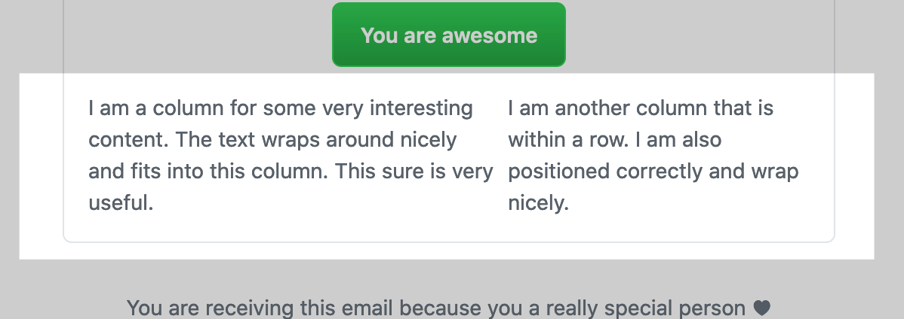

^ So when we looked into adding columns to a mailer for this design,

^ My colleague mike thought we could build some ViewComponents to abstract away all of the tables and inline CSS.

---

[.code-highlight: none]
[.code-highlight: 1,9]
[.code-highlight: 2-8]
[.code-highlight: all]

```erb
<%= render(Mail::RowComponent.new(classes: "text-gray")) do %>
  <%= render(Mail::ColumnComponent.new(classes: "pr-2")) do %>
    I am a column for some very interesting content. The text wraps around nicely and fits into this column.
    This sure is very useful.
  <% end %>
  <%= render(Mail::ColumnComponent.new) do %>
    I am another column that is within a row. I am also positioned correctly and wrap nicely.
  <% end %>
<% end %>
```

^ To do this, he built mailer-specific components for rows and columns,

^ Which are used together,

^ S Wrap a row, which contains

^ S multiple columns

^ S giving developers a reliable way to build column layouts in mailers without having to write old-school HTML.

---

# Conceptual compression

^ This is a classic example of what Rails creator DHH calls conceptual compression.

^ By simplifying the process for building mailers,

^ We've practically removed the conceptual overhead necessary to build one correctly.

^ Instead of worrying about whether you've written your inline styles in a way that renders properly in the numerous different email clients out there,

^ you can just piece together a couple of ViewComponents and move on with your life.

---

# Abstraction

^ Just like active record simplified use of SQL

^ And controllers made it easy to write code to respond to requests

^ We use ViewComponents to make building UI correctly the default, not the exception.

^ PAUSE

---

# Slots

^ Another way ViewComponents can help simplify building UI is with Slots.

^ Slots are a way to pass multiple blocks of content to a single component.

^ So let's look at an example:

---
[.hide-footer]
[.background-color: #FFFFFF]
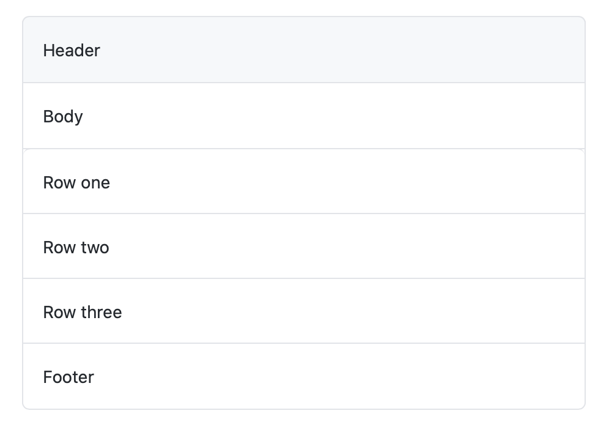

^ box component

^ from design system

---

[.code-highlight: all]
[.code-highlight: 2]
[.code-highlight: 3]
[.code-highlight: 4-8]
[.code-highlight: 9]

```html
<div class="Box">
  <div class="Box-header"><h3 class="Box-title">Header</h3></div>
  <div class="Box-body">Body</div>
  <ul>
    <li class="Box-row">Row one</li>
    <li class="Box-row">Row two</li>
    <li class="Box-row">Row three</li>
  </ul>
  <div class="Box-footer">Footer</div>
</div>
```

^ here is the html

^ S header

^ S body

^ S rows

^ S footer

^ rewrite as ViewComponent

---

`# app/components/box_component.rb`

```ruby
class BoxComponent < ViewComponent::Base
  def initialize
  end
end
```

`# app/components/box_component.html.erb`

```erb
<div class="Box">
  <div class="Box-header"><h3 class="Box-title">Header</h3></div>
  <div class="Box-body">Body</div>
  <ul>
    <li class="Box-row">Row one</li>
    <li class="Box-row">Row two</li>
    <li class="Box-row">Row three</li>
  </ul>
  <div class="Box-footer">Footer</div>
</div>
```

`# app/views/demo/index.html.erb`

```erb
<%= render(BoxComponent.new) %>
```

^ start with a component that renders our example code

^ explain code

---

`# app/views/demo/index.html.erb`

```erb
<%= render(BoxComponent.new) do %>
  <%= render(BoxHeaderComponent.new) do %>Header<% end %>
  <%= render(BoxBodyComponent.new) do %>Body<% end %>
  <ul>
    <%= render(BoxRowComponent.new) do %>Row one<% end %>
    <%= render(BoxRowComponent.new) do %>Row two<% end %>
    <%= render(BoxRowComponent.new) do %>Row three<% end %>
  </ul>
  <%= render(BoxFooterComponent.new) do %>Footer<% end %>
<% end %>
```

^ skipping a few steps, we might end up with components

^ for header, body, row and footer

^ But this puts a lot of burden on the the developer using all these components!

^ order of elements matters

^ enforce header is first?

^ enforce footer is last?

^ doesn't prevent misuse of the design system

^ this is where slots comes in

---

`# app/components/box_component.rb`

```ruby
class BoxComponent < ViewComponent::Base
  def initialize
  end
end
```

^ back in component

---

[.code-highlight: 2-5]

`# app/components/box_component.rb`

```ruby
class BoxComponent < ViewComponent::Base
  renders_one :header
  renders_one :body
  renders_many :rows
  renders_one :footer

  def initialize
  end
end
```

^ we can declare slots for the header, body, rows, and footer

---

[.code-highlight: 1-10]
[.code-highlight: 12-19]

`# app/views/demo/index.html.erb`

```erb
<%= render(BoxComponent.new) do %>
  <%= render(BoxHeaderComponent.new) do %>Header<% end %>
  <%= render(BoxBodyComponent.new) do %>Body<% end %>
  <ul>
    <%= render(BoxRowComponent.new) do %>Row one<% end %>
    <%= render(BoxRowComponent.new) do %>Row two<% end %>
    <%= render(BoxRowComponent.new) do %>Row three<% end %>
  </ul>
  <%= render(BoxFooterComponent.new) do %>Footer<% end %>
<% end %>

<%= render(BoxComponent.new) do |component| %>
  <% component.header do %>Header<% end %>
  <% component.body do %>Body<% end %>
  <% component.row do %>Row one<% end %>
  <% component.row do %>Row two<% end %>
  <% component.row do %>Row three<% end %>
  <% component.footer do %>Footer<% end %>
<% end %>
```

^ In template that renders component

^ refactor it

^ S to use slots instead of separate components

^ PAUSE

---

[.code-highlight: 2]
[.code-highlight: 2-3]
[.code-highlight: 2-4]
[.code-highlight: 2-7]
[.code-highlight: 11]
[.code-highlight: all]

`# app/components/box_component.html.erb`

```erb
<div class="Box">
  <div class="Box-header"><h3 class="Box-title"><%= header %></h3></div>
  <div class="Box-body"><%= body %></div>
  <% if rows.any? %>
    <ul>
      <% rows.each do row %>
        <li class="Box-row"><%= row %></li>
      <% end %>
    </ul>
  <% end %>
  <div class="Box-footer"><%= footer %></div>
</div>
```

^ then, in the component template, we can

^ render the

^ S header

^ S and body

^ S render the rows, which are exposed as an array,

^ Which means iterating over the collection, check to see if it's empty, etc.

^ S and footer

^ S inside wrapping div

^ PAUSE

---

```erb
<%= render(BoxComponent.new) do |component| %>
  <% component.header do %>Header<% end %>
  <% component.body do %>Body<% end %>
  <% component.row do %>Row one<% end %>
  <% component.row do %>Row two<% end %>
  <% component.row do %>Row three<% end %>
  <% component.footer do %>Footer<% end %>
<% end %>
```

^ ended up with a codification of the design system

^ helping developers use it properly

^ PAUSE

---

# Storybook

^ Another thing we've experimented with is Storybook.

---

[.slidenumbers: false]
[.background-color: #FFFFFF]
[.footer:]

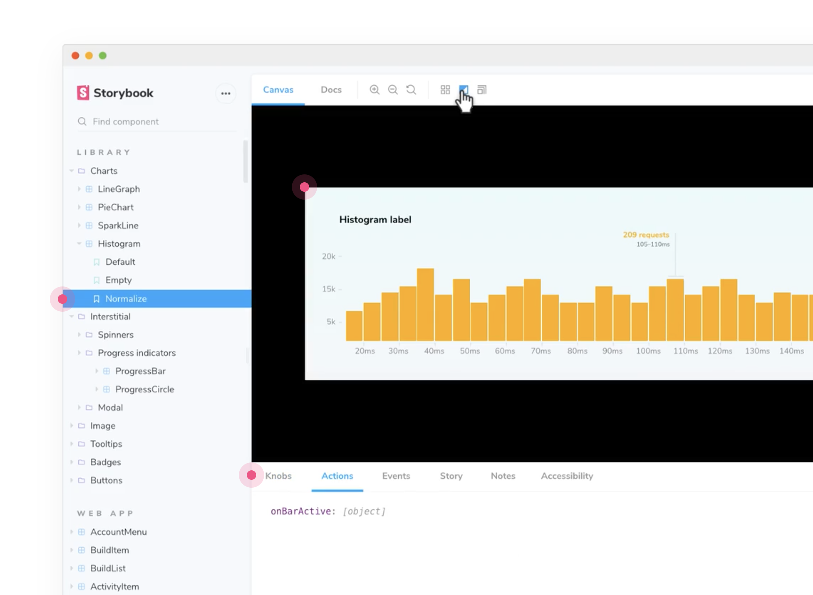

^ Storybook is an open source tool for developing components in isolation.

^ It's quite popular (something like almost 60k stars)

^ And thanks to the work of community member Jon Palmer...

^ It supports ViewComponents!

^ Here's an example of it in action with our Flash ViewComponent

---

[.slidenumbers: false]
[.background-color: #FFFFFF]
[.footer:]


^ Here you can see it previewing a change to the icon

^ and a change to the variant

^ PAUSE

^ This gives us a development environment for building components

^ outside of a Rails application, such as in our Primer ViewComponents library.

---

[.slidenumbers: false]
[.background-color: #FFFFFF]
[.footer:]

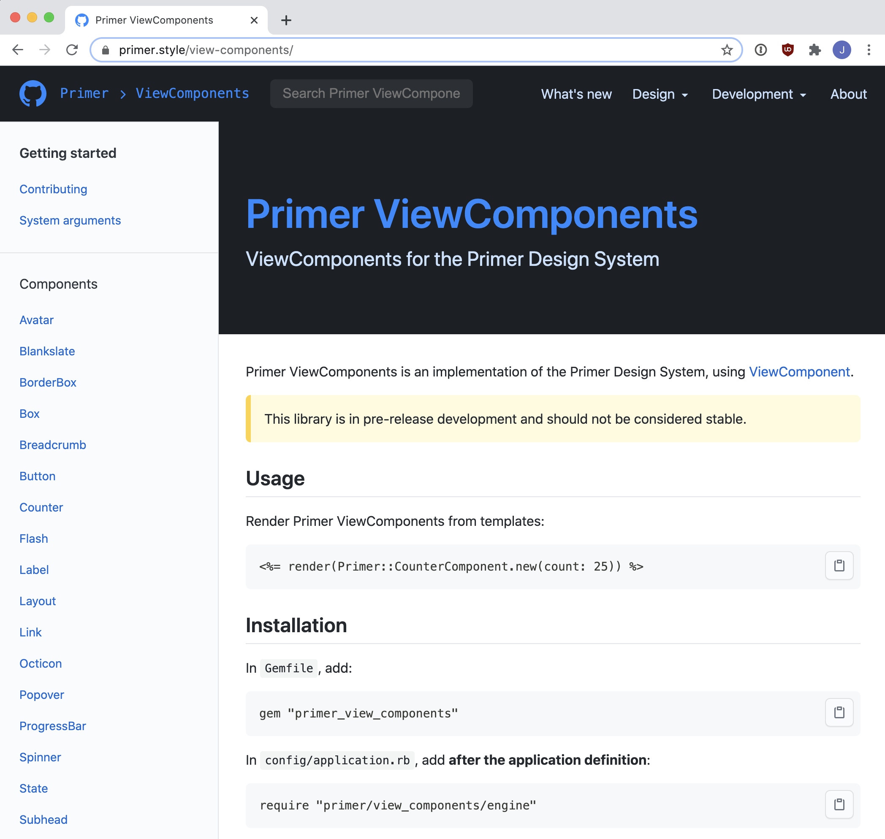

^ We open-sourced the library over the summer, and it now has over two dozen components.

^ PAUSE

^ And we aren't the only ones doing so!

---

[.slidenumbers: false]
[.background-color: #FFFFFF]
[.footer:]

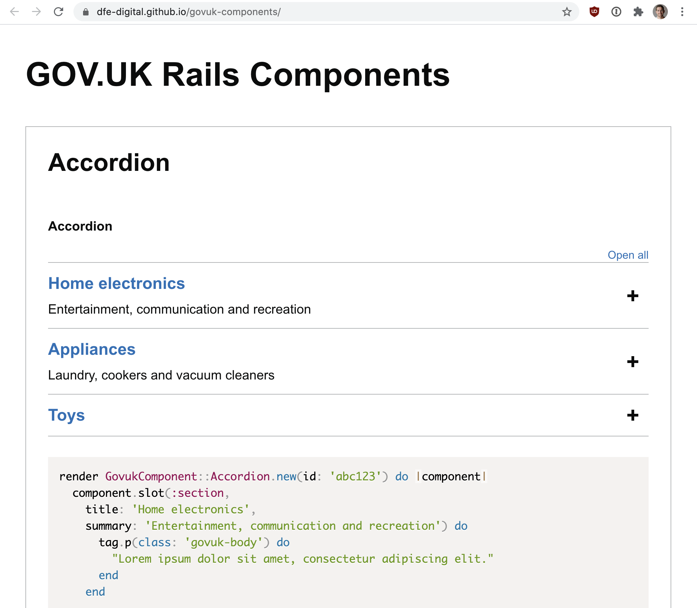

^ UK department for education has released a library

^ Of over a dozen viewcomponents for the Gov.uk design system.

---

[.slidenumbers: false]
[.footer:]


^ PAUSE

^ So one of the common questions I get about this project from folks outside of GitHub

---

# Rolling it out

^ Is how are we rolling it out?

^ It's sometimes asked in a technical context, writing new components, refactoring old views, etc

^ And organizational- how do we ensure components are use appropriately, how do we make the case for this work with non-engineering stakeholders, etc.

---

# Technical

^ So let's start with the technical

---
# Authoring

^ How do we create ViewComponents?

---

# Refactoring

^ The first way is by refactoring existing view code into components.

^ For example, before ViewComponents, we used a presenter-like pattern

^ called view models, ruby objects we instantiate and then pass into views

---

[.code-highlight: 1-5]
[.code-highlight: 7-15]
[.code-highlight: 10-12]

```ruby
class RepositoryIndexView < ViewModel
  def status
    repository.locked? ? "Disabled" : "Enabled"
  end
end

class RepositoryIndexViewTest < Minitest::Test
  context "#status" do
    test "enabled for unlocked repository" do
      view = RepositoryIndexView.new(repository: create(:repository))

      assert_equal view.status, "Enabled"
    end
  end
end
```

^ Here's an example ViewModel - explain code

^ S and the test looks like this

^ S It instanstiates the view, and asserts against the object output

^ So that's a ViewModel. We'd pass this object into a template and access values from it.

^ PAUSE

---

[.code-highlight: 1-5]
[.code-highlight: 7-17]
[.code-highlight: 10-12]
[.code-highlight: 12]

```ruby
class RepositoryIndexComponent < ViewComponent::Base
  def status
    repository.locked? ? "Disabled" : "Enabled"
  end
end

class RepositoryIndexComponentTest < Minitest::Test
  context "status" do
    test "enabled for unlocked repository" do
      render_inline(RepositoryIndexView.new(repository: create(:repository))

      assert_text "Enabled"
    end
  end
end
```

^ And here's what it looks like rewritten as a ViewComponent

^ Explain code - base class has changed

^ S for the test, not much changes either

^ S explain code

^ But there's something fundamentally different about this test.

^ Instead of asserting against the attribute of an object like we did with the viewmodel

^ S We're asserting against what's actually presented to a user

^ This is something we previously could only do with system and integration tests

^ And it's one of the main reasons we refactor ViewModels to be ViewComponents:

^ To gain confidence that our view code is working correctly from the perspective of our customers.

^ PAUSE

---

# New components

^ We also write view components from scratch

^ We consider the reasons I mentioned earlier:

---

# Consistency

^ Is there a need for strong consistency?

---

# Performance

^ Are there performance concerns?

---

# Complexity

^ Is the view complex, with many different possible states?

^ If so, we might use a component so we can unit test all of the permutations.

---

#  Partial / ViewModel

^ But the most common case for using ViewComponents is in place of a partial or ViewModel.

^ PAUSE

---

# Organizational

^ When it comes to the organizational side of things

---

# Communication

^ Communication has been incredibly important.

^ It takes many different forms

---


# Documentation

^ One way we communicate about viewcomponents is via documentation.

^ For our open-sourced Primer ViewComponents, we use YARD

^ Which is based on RDoc

^ Here's how we use it:

---

[.code-highlight: 0]
[.code-highlight: 4]
[.code-highlight: 6-9]
[.code-highlight: 11-12]
[.code-highlight: all]

```ruby
# ../primer/progress_bar_component.rb

module Primer
  # Use ProgressBar to visualize task completion.
  class ProgressBarComponent < Primer::Component
    # @example Default
    #   <%= render(Primer::ProgressBarComponent.new) do |component| %>
    #     <% component.slot(:item, percentage: 25) %>
    #   <% end %>
    #
    # @param size [Symbol] <%= one_of(Primer::ProgressBarComponent::SIZE_OPTIONS) %> Increases height.
    # @param system_arguments [Hash] <%= link_to_system_arguments_docs %>
    def initialize(size: SIZE_DEFAULT, **system_arguments)
```

^ S At the top of the class, we write comment describing the function of the component.

^ S We also provide ERB examples of how to use the component.

^ S And annotations for the each of the parameters.

^ S This allows us to write our documentation alongside our code, keeping it up to date.

^ PAUSE

^ But then the fun begins. We use these annotations to generate our documentation site!

^ Here's how:

---
[.code-highlight: 3]
[.code-highlight: 5]
[.code-highlight: 7]

```ruby
# Rakefile

Rake::Task["yard"].execute

registry = YARD::RegistryStore.new.load!(".yardoc")

docs = registry.get(Primer::ProgressBarComponent)
```

^ In the library's Rakefile

^ S We start by running the YARD rake task, which parses the project for YARD annotations

^ S Then, we load the parsed YARD output into the Yard RegistryStore object

^ S From there, we load the docs for our component from the registry.

---

[.code-highlight: 0]
[.code-highlight: 1-2]
[.code-highlight: 4-5]
[.code-highlight: 7-8]
[.code-highlight: 10-11]
[.code-highlight: 13-14]

```ruby
irb> documentation.base_docstring
=> "Use ProgressBar to visualize task completion."

irb> initialize_method = documentation.meths.find(&:constructor?)
=> <yardoc method Primer::ProgressBarComponent#initialize>

irb> initialize_method.tags(:param).map(&:name)
=> ["size", "system_arguments"]

irb> example_text = initialize_method.tags(:example).first.text
=> "<%= render(Primer::ProgressBarComponent.new) do |component| %>\n  <% component.slot(:item, percentage: 25) %>\n<% end %>"

irb> ApplicationController.new.view_context.render(inline: example_text)
=> "<span class='Progress '>    <span style='width: 25%;' class='Progress-item bg-green'></span></span>"
```

^ At that point, we now have the parsed documentation available in a Ruby object!

^ S Which includes the class description

^ S It also has data on each method. Let's look at the one that is marked as the constructor.

^ S First, we can see the names of the parameters

^ S We can also see the text of the example we wrote. Unfortunately, it's still in ERB

^ S But we can fix that by rendering the example using an instance of our Application Controller, passed as an inline template.

^ from here, we have what we need to build our documentation page:

---

[.code-highlight: 0]
[.code-highlight: 1]
[.code-highlight: 3]
[.code-highlight: 9]
[.code-highlight: 11-13]

```md
# ProgressBar

Use ProgressBar to visualize task completion.

## Examples

### Default

<span class='Progress '><span style='width: 25%;' class='Progress-item bg-green'></span></span>

<%= render(Primer::ProgressBarComponent.new) do |component| %>
  <% component.slot(:item, percentage: 25) %>
<% end %>

```

^ We use that data to build a markdown file

^ S With the class name as the title,

^ S The description we wrote for the component class below it,

^ S the inline HTML of the rendered example,

^ S And the original ERB code.

---

[.slidenumbers: false]
[.background-color: #FFFFFF]
[.footer:]


^ Rendered on the docs site, it looks like this.

^ This standardized approach keeps our documentation consistent.

^ I think my favorite part is that the documentation is consumable both via the component code's comments and via the published site, as people seem to prefer one or the other.

^ PAUSE

---

# Linters

^ Another way we communicate with other developers about ViewComponents is via linters.

^ I've never seen linters used as extensively as they are at GitHub.

---

[.slidenumbers: false]
[.background-color: #FFFFFF]
[.footer:]


^ For example, we have a bot that automatically reviews pull requests for cases where we'd prefer people to use existing ViewComponents!

^ EXPLAIN SCREENSHOT - note link to documentation site generated by YARD

^ This saves us from having to make these suggestions manually in code reviews.

^ PAUSE

^ Another way we use linters is with custom Rubocops.

---

[.code-highlight: 6]
[.code-highlight: 9]
[.code-highlight: 10]
[.code-highlight: 7, 11]

```ruby
# test/rubocop/cop/view_component/prefer_view_components.rb

module RuboCop
  module Cop
    module ViewComponent
      class PreferViewComponents
        MSG = "Avoid adding ViewModels..."

        def on_class(node)
          if node.node_parts.compact.any? { |n| n.node_parts.last.to_s == "ViewModel" }
            add_offense(node, message: MSG)
          end
        end
      end
    end
  end
end
```

^ we have a Rubocop to encourage people to use ViewComponents instead of ViewModels.

^ S It looks at class syntax tree nodes

^ S Sees if the class is a ViewModel

^ S And if it is, adds an offense with a helpful message

^ PAUSE

^ At our scale, if we want to do something consistently, the only answer is tooling and metrics that guide people toward the right solution.

^ PAUSE

---

[.slidenumbers: false]
[.background-color: #FFFFFF]
[.footer:]

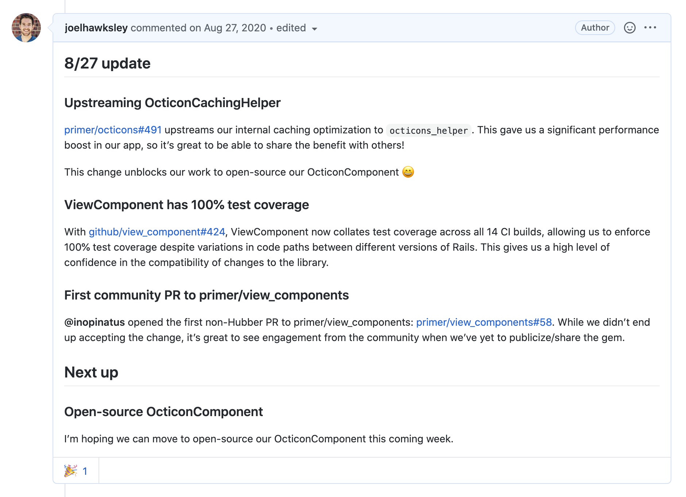

^ Another way we communicate is weekly updates. For a lot of our projects, we use an issue to track our progress.

^ Usually share a handful of highlights

^ Examples of improvements from using the pattern (such as the cases I've shared today)

^ This provides company leadership with case studies they can use to justify the work we're doing.

^ PAUSE

^ At some point though, there's no substitute for putting in the time.

^ PAUSE

---

# Resourcing

^ So over the summer, we put together a team of about half a dozen engineers

^ And spent two months building new ViewComponents and rolling out existing ones.

---

[.slidenumbers: false]
[.background-color: #FFFFFF]
[.footer:]

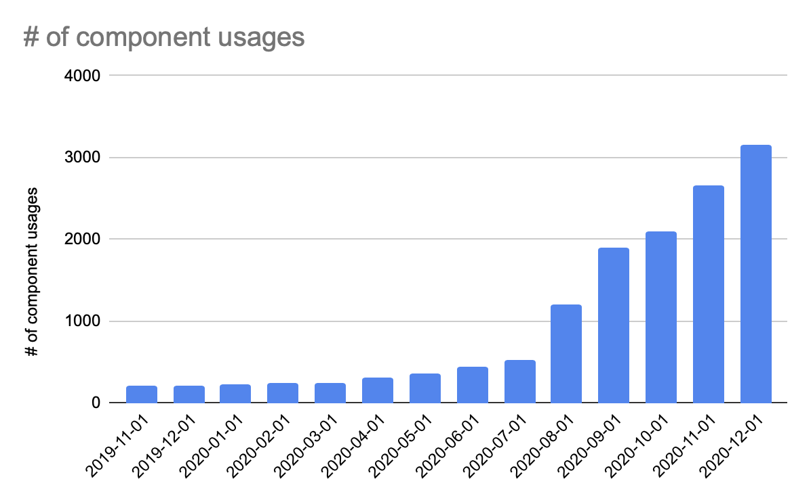

^ And the the results were dramatic.

^ this is a graph of how many places we render a component in the GitHub.com codebase

^ The graph is pretty stable until August first, where the slope changes suddenly

^ In the two months the team worked on the rollout, we quadrupled the number of uses of components in the codebase.

^ But even after the team disbanded, the gains continued! How could that be?

---

# Copy-paste

^ I think part of it is that we now had a critical mass of component-based examples for engineers to reuse as they built new UI.

^ But how do we ensure that we're reusing the correct examples?

^ With linters!

^ For example, if I was to use the non-component implementation of the Counter component, I get this message:

---

```
There was 1 discrepancy in usage counts for components:
  Counter    expected: 0    actual:  1    Please use Primer::CounterComponent...
```

^ For each component, we set a number of places we allow for the non-component implementation to be used.

^ If someone adds another usage, this linter fails their build, and suggests they use the component.

^ As we roll out a new component, we decrease the number of exceptions, preventing new ones from being introduced.

^ PAUSE

^ We also reuse this code to generate a report on our progress:

---

| Name                        | CSS Uses | Component Uses | % Migrated |
|-----------------------------|----------|----------------|------------|
| Avatar                      | 284      | 19             | 6.27%      |
| Blankslate                  | 0        | 492            | 100.0%     |
| Breadcrumb                  | 2        | 34             | 94.44%     |
| ...                         |          |                |            |

^ For example, you can see that we've migrated every Blankslate to use the component we built.

---

[.slidenumbers: false]
[.footer:]


^ PAUSE

^ One of the other questions I get about the project is:

^ what have I learned by open sourcing it?

^ I should caveat this by saying that this is the only open source project I've worked on.

^ PAUSE

^ By many measures, the ViewComponent project has been very successful.

---

[.slidenumbers: false]
[.background-color: #FFFFFF]
[.footer:]


^ We've been lucky to have a lot of engagement on the project.

^ We've had code contributions from almost a hundred developers, only a dozen of which work for GitHub.

^ And working with so many different people from all around the world

---

# Empathy

^ has been a huge lesson in empathy.

^ What's stuck out to me is that in every issue, PR, or discussion post

^ There is something to be learned. Even the small stuff.

^ If someone was confused by the documentation and wrote a component incorrectly,

^ it's evidence we can use to improve our docs.

^ If an error message doesn't help someone fix the error and they file an issue about it, we should probably improve the error message!

^ PAUSE

---
# Enabling contribution

^ It's clear to me that people want to contribute. But they're not always sure how.

^ Which is why we've focused on making it easy to contribute.

^ We want to enable people to make high-quality contributions as easily as possible.

^ The library isn't super complicated,

^ but it has some nuance and differing behavior across Rails versions.

^ We support the combinations of several versions of Ruby and Rails, and making sure the framework works for all of them is critical.

^ One way we've reduced the burden of this is through matrix builds

---

[.slidenumbers: false]
[.background-color: #FFFFFF]
[.footer:]


^ By running the test suite against over a dozen combinations

^ of Ruby and Rails, we're able to ensure every change works across all the of those combinations

^ But perhaps more importantly...

---

# Test coverage

^ It's enabled us to ensure we have 100% test coverage,

^ By combining coverage data from all of the matrix builds.

^ Having a confident foundation like this makes it easier to accept contributions from the community.

---

[.code-highlight: 0]
[.code-highlight: 2-6]
[.code-highlight: 7-13]

```yml
test:
  - name: Upload coverage
    uses: actions/upload-artifact@master
    with:
      name: simplecov-rails${{matrix.rails_version}}-ruby${{matrix.ruby_version}}
      path: coverage
coverage:
  needs: test
  steps:
  - name: Download coverage
    uses: actions/download-artifact@v2
  - name: Collate simplecov
    run: rake coverage:report
```

^ We do this with artifacts.

^ In our Actions configuration, we

^ S upload contents of the simplecov directory as an artifact

^ S And then in a dependent build that runs after all of the test builds,

^ We download all of the coverage artifacts and run a rake task to combine the coverage results:

---

[.code-highlight: 7]
[.code-highlight: 5-7]

```ruby
# Rakefile

namespace :coverage do
  task :report do
    SimpleCov.minimum_coverage 100

    SimpleCov.collate Dir["simplecov-resultset-*/.resultset.json"], "rails" do
      formatter SimpleCov::Formatter::Console
    end
  end
end
```

^ That task loads the artifacts into the Simplecov collator

^ S Which we configure with a 100% coverage requirement

^ This means that a build will fail if it contains untested code.

^ With all this infrastructure in place, it's a lot easier to accept PRs with passing tests!

^ Since we can be quite sure they don't break existing APIs.

^ PAUSE

^ Another lesson I've learned is how powerful Rails convention is.

---
# Convention

^ When writing ViewComponent

^ we aimed to conceptually align the framework with Rails as much as possible.

^ Rails conventions mean baseline expectations outside framework

^ and these conventions have enabled others to almost instinctively know how to contribute

---

[.slidenumbers: false]
[.background-color: #FFFFFF]
[.footer:]

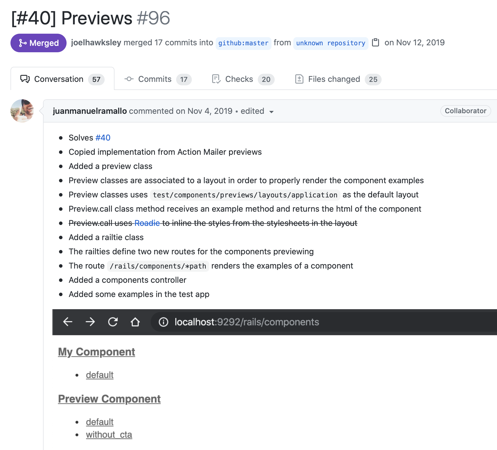

^ For example, Juan Manuel contributed ViewComponent previews,

^ largely based on the convention established by ActionMailer previews.

---

[.slidenumbers: false]
[.footer:]


^ PAUSE

^ I also think it's worth talking about what hasn't been going so well.

^ There is one problem with this approach that I can't shake:

---

[.slidenumbers: false]
[.background-color: #FFFFFF]
[.footer:]


^ It means that we now have two ways of writing views that work differently.

^ I can't imagine Rails having native support for ViewComponents,

^ At least as they exist today in a separate directory.

---

# What to extract?

^ But it makes me wonder if we could extract some of the lessons from ViewComponent into Rails.

^ One example of this is Andrew Culver and Dom Christie's Nice Partials gem.

---

[.code-highlight: all]
[.code-highlight: 2,6]

```erb
<%= render 'card', title: 'Some Title' do |p| %>
  <% p.content_for :body do %>
    Lorem ipsum dolor sit amet...
  <% end %>

  <% p.content_for :image do %>
    <%= image_tag image_path('example.jpg'), alt: 'An example image' %>
  <% end %>
<% end %>
```

^ Nice partials provides a similar API to ViewComponent's slots,

^ S Allow for multiple blocks of content to be passed to a partial.

^ Maybe this is something we could add to Rails!

^ PAUSE

---

# Improving ActionView

^ I think this is what we ultimately need to focus on in the long term.

^ From our work on ViewComponent, we've identified ways ActionView could be improved.

^ And as ViewComponent's API matures, we'll have an increasingly clear idea of what those improvements might look like.

^ PAUSE

---

# Design from experience

^ By doing so, we'll be able to design the future of building UI in Rails

^ from experience, not hypothesis.

^ PAUSE

^ One example of this is the lack of robust support for caching in ViewComponent

^ We don't do much view caching at GitHub,

^ so it's more difficult for us to build the framework support for it

^ This is one area where we could really use some help.

^ PAUSE

---

[.slidenumbers: false]
[.footer:]


^ More broadly, this project has made me think about is innovation in Rails.

---

[.slidenumbers: false]
[.background-color: #FFFFFF]
[.footer:]


^ There is a book called the innovator's dilemma.

^ Widely considered to be one of the most influential business books ever written.

---

## The Innovator's Dilemma is the decision between catering to current needs, or adopting new innovations and technologies which will answer future needs.

^ READ QUOTE

^ The book demonstrates how successful, outstanding organizations can do everything "right" and still lose their market leadership,

^ or even fail – as new, unexpected competitors rise and take over the market

---

# Relevance

^ PAUSE

^ And I think this is an important lesson we need to consider about the long term relevance of Rails.

^ The reason this matters so much to me, is that...

---

# Dependency

^ GitHub's future is pretty dependent on Rails remaining relevant.

^ We have so much built on top of Rails

^ it's very unlikely we'd rewrite our core application.

^ So what does that mean for all of us?

---

# Innovate

^ It means that we need to innovate!

^ We need to experiment with new and potentially disruptive ideas like ViewComponent,

^ because improving Rails is the only way we'll survive.

---

# Citizenship

^ We need to take ownership of keeping Rails relevant for the long term.

^ By being good citizens. By participating.

---

# We need you!

^ Rails was built by people just like all of you

^ And we benefit from the work others have put in

^ but we need more voices.

^ PAUSE

---

# Extractors

^ We need more extractors.

^ Many rails developers have worked on multiple apps.

^ We know what the underlying deficencies are.

^ We know what gems we add to every app we build.

^ We know the pain points.

^ PAUSE

^ And the survival of our companies depends on it, because...

---

# Picking a framework is forever

^ Picking a framework is forever:

^ Rewrites are rare.

^ But yet the world moves on

---

# It's up to us.

^ Which means it's up to us to keep Rails relevant.

^ PAUSE

---

# Thanks

^ Thanks
